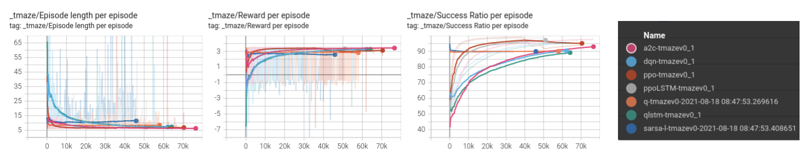
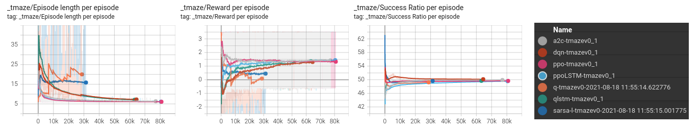
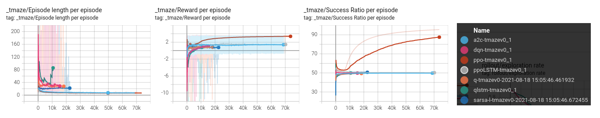

# Algorithms For Partially Observable T Maze Environments (With Stable Baselines 3)

## Installation

### Opening with vscode dev containers(Recommended)

To run with vscode, please install the extention "Remote - Containers" and after that open the project folder normally.

By default it asks that this project contains a Dev Container configuration file and you can open this folder by clicking the button "Reopen in Container".

If it does not show up, you can press F1 and search for "Remote Containers: Reopen in Container"

### Install with docker

```bash
cd .devcontainer
docker build --build-arg UNAME=$(whoami) --build-arg UID=$(id -u) --build-arg GID=$(id -g) -t pomdp:v0 .

docker run --privileged --gpus all --env http_proxy=$http_proxy --env https_proxy=$https_proxy -d --net=host --restart always --name $(whoami)-pomdp -v $(pwd)/../:/home/$(whoami)/workspace pomdp:v0
```

After that you you can clone the code and run.

### Local Installation

`conda create -n pomdp python=3.8`

Install Pytorch with your own configuration

#### Example configuration for Cuda 10.2, pip, linux build

`pip3 install torch torchvision torchaudio`

Note: If you are planning to use Cuda 11, then please follow the instructions on the link below:
<https://pytorch.org/get-started/locally/>

### Installing the additional dependencies
`conda install -c conda-forge gym scikit-learn profilehooks progressbar matplotlib tensorboard numpy pandas flake8 -y`
`pip install tensorboard-reducer --no-dependencies --trusted-host pypi.org --trusted-host files.pythonhosted.org`
`pip install git+https://github.com/DLR-RM/stable-baselines3 --trusted-host pypi.org --trusted-host files.pythonhosted.org`
`pip install git+https://github.com/Stable-Baselines-Team/stable-baselines3-contrib@feat/ppo-lstm --trusted-host pypi.org --trusted-host files.pythonhosted.org`

Note: Please visit <https://stable-baselines3.readthedocs.io/en/master/index.html> for stable baselines 3 detailed documentation.

### Running the code with cpu configuration
`conda activate pomdp`
`python start_main.py`
`python train_compare_architectures.py`

### Running the code with multi-gpu configuration

`screen -R pomdp # optional - recommended when starting training from ssh.`
`conda activate pomdp`
`python train_compare_algorithms.py multigpu`
`python train_compare_architectures.py multigpu`

### Running the tensorboard to observe the learning

`tensorboard --logdir ./logs/t_maze_tensorboard/`

Note: Please change the directory `./logs/t_maze_tensorboard/` accordingly to your configuration.

### Calculating the averages of parallel runs

For these algorithms, run these commands below:

```bash
# For Comparing Algorithms
tb-reducer -o logs/t_maze_tensorboard/q/ -r mean --lax-steps --lax-tags logs/t_maze_tensorboard/q-t*
tb-reducer -o logs/t_maze_tensorboard/sarsa/ -r mean --lax-steps --lax-tags logs/t_maze_tensorboard/sarsa*
tb-reducer -o logs/t_maze_tensorboard/qlstm/ -r mean --lax-steps --lax-tags logs/t_maze_tensorboard/qlstm*
tb-reducer -o logs/t_maze_tensorboard/ppo/ -r mean --lax-steps --lax-tags logs/t_maze_tensorboard/ppo-*
tb-reducer -o logs/t_maze_tensorboard/a2c/ -r mean --lax-steps --lax-tags logs/t_maze_tensorboard/a2c-*
tb-reducer -o logs/t_maze_tensorboard/ppoLSTM/ -r mean --lax-steps --lax-tags logs/t_maze_tensorboard/ppoLSTM-*

# For Comparing Architectures

logdir='results_comp_architectures/c_architectures_tb'
tb-reducer -o $logdir/no_memory -r mean --lax-steps --lax-tags --min-runs-per-step 4 -f $logdir/no_memory-* 
tb-reducer -o $logdir/o_k -r mean --lax-steps --lax-tags --min-runs-per-step 4 -f $logdir/o_k-* 
tb-reducer -o $logdir/oa_k -r mean --lax-steps --lax-tags --min-runs-per-step 4 -f $logdir/oa_k-* 
tb-reducer -o $logdir/lstm -r mean --lax-steps --lax-tags --min-runs-per-step 4 -f $logdir/lstm-* 
logdir='results_comp_architectures/intr_c_architectures_tb'
tb-reducer -o $logdir/no_memory_intr -r mean --lax-steps --lax-tags --min-runs-per-step 4 -f $logdir/no_memory_intr-* 
tb-reducer -o $logdir/o_k_intr -r mean --lax-steps --lax-tags --min-runs-per-step 4 -f $logdir/o_k_intr-* 
tb-reducer -o $logdir/oa_k_intr -r mean --lax-steps --lax-tags --min-runs-per-step 4 -f $logdir/oa_k_intr-* 
tb-reducer -o $logdir/lstm_intr -r mean --lax-steps --lax-tags --min-runs-per-step 4 -f $logdir/lstm_intr-* 

```

## Detailed Information About The Project Structure

- `start_main.py`

This is the main code for starting an experiment with defined parameters.
For conducting an experiment, please configure the parameters in this file and run this code by executing the command `python3 start_main.py`.
By design, every agent implementation will start in a new process(Multiprocessing with GPU is also supported), and the results will be logged into given tensorboard path.

Before starting any experiment, please customize the learning_setting dictionaries which are named `*_learning_setting` (where * is the agent name, please see `start_main.py` for examples).

Each learning_setting dictionary needs different parameters to work. The must-have learning parameters are defined in each method of the `UtilStableAgents.py` file.

- `UtilStableAgents.py`

In this file, methods for starting the agents to train for given environment is defined. These methods will get the learning_settings dictionary for parameterizing the learning process.

In order to add a new agent implementation(or ready to use SB3 implementation), create a method with given method name and signature: `def train_***_agent(learning_setting):`

Inside the method, you can create a model for given environment and start the learning process. You can also save it after the learning. Please remember that this method will be called from the multiprocessing pipeline in the `start_main.py`. So you dont need to call this function anywhere besides `start_main.py`.

In the `TensorboardCallback(BaseCallback)` class, there is an example tensorboard callback function for customizing the tensorboard. You can create your own callback class for adding new metrics, etc.

List of currently implemented/used algorithms:

```text
Q Learning
Sarsa(Lambda)
Deep Q Learning(DQN) With MLP Policy Network
Proximal Policy Optimization(PPO) With MLP Policy Network
DQN With LSTM Policy Network
PPO With LSTM Policy Network
Advantage Actor Critic(A2C)
```

- `EnvTMaze.py`

In this file, the T-Maze Environment is implemented with many different versions. There are:

```text
TMazeEnv - T-Maze Environment with full observation
TMazeEnvV1 - T-Maze Environment with partial observation
TMazeEnvV2 - T-Maze Environment with partial observation(with the state implementation from the original paper)
TMazeEnvV3 - T-Maze Environment with full observation with one hot vectors as states
TMazeEnvV4 - T-Maze Environment with partial observation with one hot vectors as states
TMazeEnvV5 - T-Maze Environment with partial observation with external memory wrapper
    (adding new memory actions as new actions, example actions: (north), (south), (east), (east), (set bit))
TMazeEnvV6 - T-Maze Environment with partial observation with external memory wrapper (cross product of two action sets)
    (embedding the memory actions with standard actions, example actions: (north+set bit), (east+nop), (east+nop), (south+clear bit), ... etc.
TMazeEnvV7 - T-Maze Environment - partial observation with external memory of fixed size sequence with observations
    (adding new memory actions as new actions, example actions: (north), (south), (east), (east), (add obs to memory)
TMazeEnvV8 - T-Maze Environment - partial observation with external memory of fixed size sequence with observations
    (embedding the memory actions with standard actions, example actions: (north+set bit), (east+nop), (east+nop), (south+clear bit), ... etc.
TMazeEnvV9 - T-Maze Environment - partial observation with external memory - Generic Memory Implementation(None, Kk, Bk, Ok, OAk Memory Types) (Possible actions are the cross product of movement and memory action sets)
    Ref: Icarte, Rodrigo Toro, et al. "The act of remembering: a study in
    partially observable reinforcement learning."
    arXiv preprint arXiv:2010.01753 (2020).
```

- `Class*Agent.py`

In these files, custom agents could be implemented, by design, custom agent classes have some basic methods defined as:

```python
def __init__(self, env, learning_setting):
def learn(self, total_timesteps, tb_log_name):
def pre_action(self, observation):
def post_action(self, observation, action, reward, next_observation, done):
def get_action(self, observation):
def post_episode(self):
```

for ease up the implementation process. You can create your own agent by following these classes.

- `UtilPolicies.py`

In this file, custom policies could be defined for stable baselines agents.

- `test_all.py`

In this file, some unit test functions are defined to check the integrity of the code while implementing new features.

## T-Maze Environment

### General Information

T-Maze Environment is a single agent navigation problem which the goal is to reach the end of the maze platform. At the end of the maze, there is a cross-road where the agent needs to decide to turn the correct direction. The correct turn information is either encoded in the state information all the time or only the start of the episode, depending the configuration of the environment(MDP or POMDP). The name of this environment comes from the shape of the maze which it could be seen as T-shaped. The length of the maze can be varied and it is parameterized with the integer N in this environment.

B. Bakker. Reinforcement Learning with long short-term Memory. Advances in Neural Information
Processing Systems, 2(14):1475–1482, 2002
<http://papers.neurips.cc/paper/1953-reinforcement-learning-with-long-short-term-memory.pdf>

Also, for the partially observable configuration, the main difficulty comes from the need of remembering the long term dependencies. This simple change in this environment makes the problem very hard to optimally solve for all cases.

Below, you can see a maze with length 6:

```python
grid=['XXXXX_',
      'O_____',
      'XXXXX_']
```

An agent starts in the coordinate (1, 0). This position is marked as O in this array and the episode ends when the agent either arrives/turns to (0, N) or (2, N).

### States and Actions

States are 3-dimensitonal discrete variables which is defined below:

```pseudo
state = [x, y, y of the true goal location]
```

Actions are 1-dimensional discrete variables which can take these actions below:

```math
action = north/east/south/west
```

Note that this n, e, s, w notation is encoded as integers 0, 1, 2, 3 respectively.

### Example Results

- Agents Learning in Fully Observable T Maze Environment(TmazeEnv)



- Agents Learning in Partially Observable T Maze Environment(TmazeEnvV1)



- Agents Learning in Partially Observable T Maze Environment With External Memory Wrapper(TmazeEnvV5)



## License

Please see <https://github.com/BurakDmb/pomdp_tmaze_baselines/blob/main/LICENSE>.
