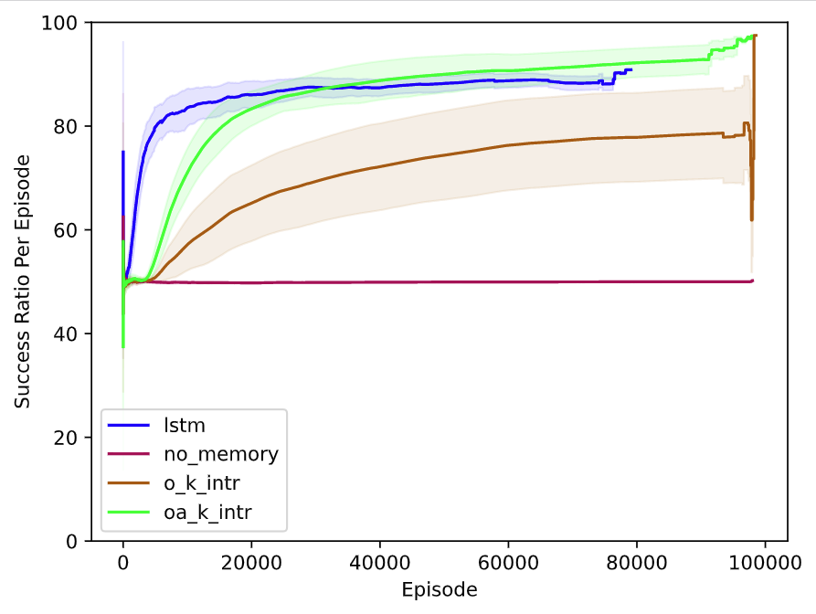

# Algorithms For Partially Observable T Maze Environments (With Stable Baselines 3)

## Installation

### Easy Installation
You can install required dependencies(including pytorch gpu cuda 11.x version) by simply running these lines:

For this configuration, it assumed that the user is in a linux(pref. Ubuntu 20.04) OS and a Nvidia GPU is exist in this PC. This configuration affects the pytorch version installation, if you want to use cpu or older cuda version, please remove the lines of torch, torchvision and torchaudio packages in environment.yml and install by yourself. Remaining other requirements are compatible with all versions of OS and gpu/cpu configurations.

Easy Installation with environment.yml and requirements.yml(used automatically in environment.yml):

```
conda env create -f environment.yml 
conda activate pomdp
```

### Manual Installation

Installing Torch and Cudatoolkit from https://pytorch.org/get-started/locally/

- pytorch
- torchvision
- torchaudio
- cudatoolkit=11.3

Installing Other Required Packages

- gym
- scikit-learn
- profilehooks
- progressbar
- matplotlib
- tensorboard
- numpy
- pandas
- cloudpickle
- optuna
- mysqlclient
- flake8

```
conda create -n pomdp python=3.8 -y
conda activate pomdp
conda install pytorch torchvision torchaudio cudatoolkit=11.3 -c pytorch -y
conda install -c conda-forge gym scikit-learn profilehooks progressbar matplotlib tensorboard numpy pandas cloudpickle optuna mysqlclient mysql-client flake8 -y
conda install pip -y
pip install tensorboard-reducer --no-dependencies --trusted-host pypi.org --trusted-host files.pythonhosted.org
pip install git+https://github.com/DLR-RM/stable-baselines3 --no-dependencies --trusted-host pypi.org --trusted-host files.pythonhosted.org
pip install git+https://github.com/Stable-Baselines-Team/stable-baselines3-contrib@feat/ppo-lstm --no-dependencies --trusted-host pypi.org --trusted-host files.pythonhosted.org
```

Stable Baselines3, SB3-Contrib packages are taken from the git repository for latest updates (especially sb3-contrib.)
Please note that below is the syntax for pip requirements file, to access the links, links are shared below:

- stable-baselines3 @ git+https://github.com/DLR-RM/stable-baselines3@54bcfa4544315fc920be0944fc380fd75e2f7c4a

Link: https://github.com/DLR-RM/stable-baselines3/tree/54bcfa4544315fc920be0944fc380fd75e2f7c4a

- sb3-contrib @ git+https://github.com/Stable-Baselines-Team/stable-baselines3-contrib@c11332460e3ae7473e34cf91c12c8a0030fd5d70

Link: https://github.com/Stable-Baselines-Team/stable-baselines3-contrib/tree/c11332460e3ae7473e34cf91c12c8a0030fd5d70

Tensorboard Reducer does not exists in conda, therefore it needs to installed from pip (https://github.com/janosh/tensorboard-reducer):
- tensorboard-reducer


## Hyperparameter Optimization With Optuna:

For hyperparameter optimization, a persistent database is required for hyperparameter optimization. With a persistent database, multiple servers/workstations can be used to optimize hyperparameters paralelly. For this reason, installation of a mysql server is required. This mysql server doesnt need to be in the same computer, one can install mysql server and codes in different devices. Optuna will connect this db server by using the connection url provided and it will save the necessary hp-search information in this database.

For the easiest configuration, an example of creating mysql server with docker is provided. The default password is set to "1234". After creating the mysql server, a database named "pomdp" is created. Please change the ip adress of "127.0.0.1" according to your mysql server installation(remote or local)

```
#Change IP adress according to your configuration
docker run --name pomdp-mysql -e MYSQL_ROOT_PASSWORD=1234 -p 3306:3306 -d mysql:8
mysql -u root -h 127.0.0.1 -p -e "CREATE DATABASE IF NOT EXISTS pomdp"
```

After then, you can modify and use `hp_search_architecture.py` python script to hyperparameter search with multi gpu(also multi gpus in many computers are automatically supported by optuna) or single gpu. 

To start searching hyperparameters with multi gpu:
`python hp_search_architecture.py multigpu 4`

No parallelization, single gpu:
`python hp_search_architecture.py`

Deleting existing study in the database (this does not delete the "logs/" directory):
`python hp_search_architecture.py delete`

To use multi computers which are in the same network, you only need to modify the `storage` variable on the other computers. You can simply replace the IP address to the mysql server and optuna(and our code) will automatically distribute the jobs regarding the number of gpus and `number_of_parallel_jobs` variable. Below, an example scenario has been shared:

```
Modified hp_search_architecture.py to have X possible hyperparameter combination. 
We want to distribute X 

# Computer 1, Local network IP Adress: IP_1, Mysql server is installed, 2 GPU is available
1- Modify storage variable to 127.0.0.1 (as own local adress)
2- python hp_search_architecture.py multigpu 2


# Computer 2, Local network IP Adress: IP_2, 8 GPU is available
1- Modify storage variable to IP-1 (For the first computers IP adress)
2- python hp_search_architecture.py multigpu 8

# With these commands, the hyperparameter space will we paralelly searched by two computers and they will not re-scan/search already scanned parameters because of the joint database.
```

## Running the code with cpu configuration
```
screen -R pomdp # optional - recommended when starting training from ssh.
conda activate pomdp
python start_main.py
python train_compare_architectures.py
```


## Running the code with multi-gpu configuration
```
screen -R pomdp # optional - recommended when starting training from ssh.
conda activate pomdp
python train_compare_algorithms.py multigpu
python train_compare_architectures.py multigpu
```

## Running the tensorboard to observe the learning

`tensorboard --logdir ./logs/t_maze_tensorboard/`

Note: Please change the directory `./logs/t_maze_tensorboard/` accordingly to your configuration.

## Calculating the averages of parallel runs

For these algorithms, run these commands below:

```bash
# For Comparing Algorithms
tb-reducer -o logs/t_maze_tensorboard/q/ -r mean --lax-steps --lax-tags logs/t_maze_tensorboard/q-t*
tb-reducer -o logs/t_maze_tensorboard/sarsa/ -r mean --lax-steps --lax-tags logs/t_maze_tensorboard/sarsa*
tb-reducer -o logs/t_maze_tensorboard/qlstm/ -r mean --lax-steps --lax-tags logs/t_maze_tensorboard/qlstm*
tb-reducer -o logs/t_maze_tensorboard/ppo/ -r mean --lax-steps --lax-tags logs/t_maze_tensorboard/ppo-*
tb-reducer -o logs/t_maze_tensorboard/a2c/ -r mean --lax-steps --lax-tags logs/t_maze_tensorboard/a2c-*
tb-reducer -o logs/t_maze_tensorboard/ppoLSTM/ -r mean --lax-steps --lax-tags logs/t_maze_tensorboard/ppoLSTM-*

# For Comparing Architectures

logdir='results_comp_architectures/c_architectures_tb'
tb-reducer -o $logdir/no_memory -r mean --lax-steps --lax-tags --min-runs-per-step 4 -f $logdir/no_memory-* 
tb-reducer -o $logdir/o_k -r mean --lax-steps --lax-tags --min-runs-per-step 4 -f $logdir/o_k-* 
tb-reducer -o $logdir/oa_k -r mean --lax-steps --lax-tags --min-runs-per-step 4 -f $logdir/oa_k-* 
tb-reducer -o $logdir/lstm -r mean --lax-steps --lax-tags --min-runs-per-step 4 -f $logdir/lstm-* 
logdir='results_comp_architectures/intr_c_architectures_tb'
tb-reducer -o $logdir/no_memory_intr -r mean --lax-steps --lax-tags --min-runs-per-step 4 -f $logdir/no_memory_intr-* 
tb-reducer -o $logdir/o_k_intr -r mean --lax-steps --lax-tags --min-runs-per-step 4 -f $logdir/o_k_intr-* 
tb-reducer -o $logdir/oa_k_intr -r mean --lax-steps --lax-tags --min-runs-per-step 4 -f $logdir/oa_k_intr-* 
tb-reducer -o $logdir/lstm_intr -r mean --lax-steps --lax-tags --min-runs-per-step 4 -f $logdir/lstm_intr-* 

```

## Detailed Information About The Project Structure

- `start_main.py`

This is the main code for starting an experiment with defined parameters.
For conducting an experiment, please configure the parameters in this file and run this code by executing the command `python3 start_main.py`.
By design, every agent implementation will start in a new process(Multiprocessing with GPU is also supported), and the results will be logged into given tensorboard path.

Before starting any experiment, please customize the learning_setting dictionaries which are named `*_learning_setting` (where * is the agent name, please see `start_main.py` for examples).

Each learning_setting dictionary needs different parameters to work. The must-have learning parameters are defined in each method of the `UtilStableAgents.py` file.

- `UtilStableAgents.py`

In this file, methods for starting the agents to train for given environment is defined. These methods will get the learning_settings dictionary for parameterizing the learning process.

In order to add a new agent implementation(or ready to use SB3 implementation), create a method with given method name and signature: `def train_***_agent(learning_setting):`

Inside the method, you can create a model for given environment and start the learning process. You can also save it after the learning. Please remember that this method will be called from the multiprocessing pipeline in the `start_main.py`. So you dont need to call this function anywhere besides `start_main.py`.

In the `TensorboardCallback(BaseCallback)` class, there is an example tensorboard callback function for customizing the tensorboard. You can create your own callback class for adding new metrics, etc.

List of currently implemented/used algorithms:

```text
Q Learning
Sarsa(Lambda)
Deep Q Learning(DQN) With MLP Policy Network
Proximal Policy Optimization(PPO) With MLP Policy Network
DQN With LSTM Policy Network
PPO With LSTM Policy Network
Advantage Actor Critic(A2C)
```

- `EnvTMaze.py`

In this file, the T-Maze Environment is implemented with many different versions. There are:

```text
TMazeEnv - T-Maze Environment with full observation
TMazeEnvPOMDP - T-Maze Environment with partial observation
TMazeEnvMemoryWrapped - T-Maze Environment - partial observation with external memory - Generic Memory Implementation(None, Kk, Bk, Ok, OAk Memory Types) (Possible actions are the cross product of movement and memory action sets)
    Ref: Icarte, Rodrigo Toro, et al. "The act of remembering: a study in
    partially observable reinforcement learning."
    arXiv preprint arXiv:2010.01753 (2020).
```

- `Class*Agent.py`

In these files, custom agents could be implemented, by design, custom agent classes have some basic methods defined as:

```python
def __init__(self, env, learning_setting):
def learn(self, total_timesteps, tb_log_name):
def pre_action(self, observation):
def post_action(self, observation, action, reward, next_observation, done):
def get_action(self, observation):
def post_episode(self):
```

for ease up the implementation process. You can create your own agent by following these classes.

- `UtilPolicies.py`

In this file, custom policies could be defined for stable baselines agents.

- `test_all.py`

In this file, some unit test functions are defined to check the integrity of the code while implementing new features.

## T-Maze Environment

### General Information

T-Maze Environment is a single agent navigation problem which the goal is to reach the end of the maze platform. At the end of the maze, there is a cross-road where the agent needs to decide to turn the correct direction. The correct turn information is either encoded in the state information all the time or only the start of the episode, depending the configuration of the environment(MDP or POMDP). The name of this environment comes from the shape of the maze which it could be seen as T-shaped. The length of the maze can be varied and it is parameterized with the integer N in this environment.

B. Bakker. Reinforcement Learning with long short-term Memory. Advances in Neural Information
Processing Systems, 2(14):1475–1482, 2002
<http://papers.neurips.cc/paper/1953-reinforcement-learning-with-long-short-term-memory.pdf>

Also, for the partially observable configuration, the main difficulty comes from the need of remembering the long term dependencies. This simple change in this environment makes the problem very hard to optimally solve for all cases.

Below, you can see a maze with length 6:

```python
grid=['XXXXX_',
      'O_____',
      'XXXXX_']
```

An agent starts in the coordinate (1, 0). This position is marked as O in this array and the episode ends when the agent either arrives/turns to (0, N) or (2, N).

### States and Actions

States are 3-dimensitonal discrete variables which is defined below:

```pseudo
state = [x, y, y of the true goal location]
```

Actions are 1-dimensional discrete variables which can take these actions below:

```math
action = north/east/south/west
```

Note that this n, e, s, w notation is encoded as integers 0, 1, 2, 3 respectively.

### Example Results

- Agents Learning in Fully Observable T Maze Environment(TmazeEnv)


- Agents Learning in Partially Observable T Maze Environment(TMazeEnvPOMDP)



- Agents Learning in Partially Observable T Maze Environment With External Memory Wrapper(TmazeEnvV5)


## License

Please see <https://github.com/BurakDmb/pomdp_tmaze_baselines/blob/main/LICENSE>.
